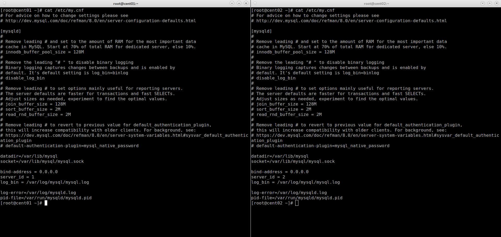
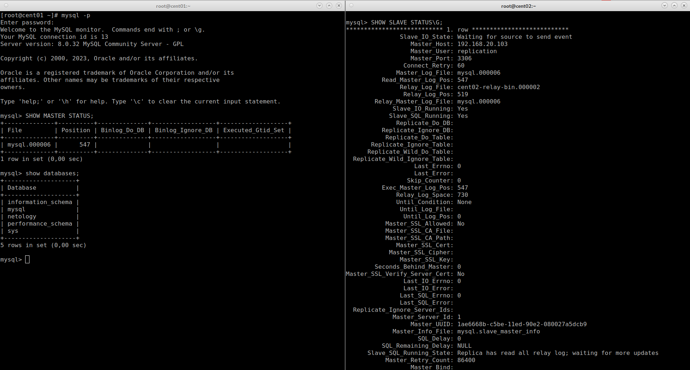
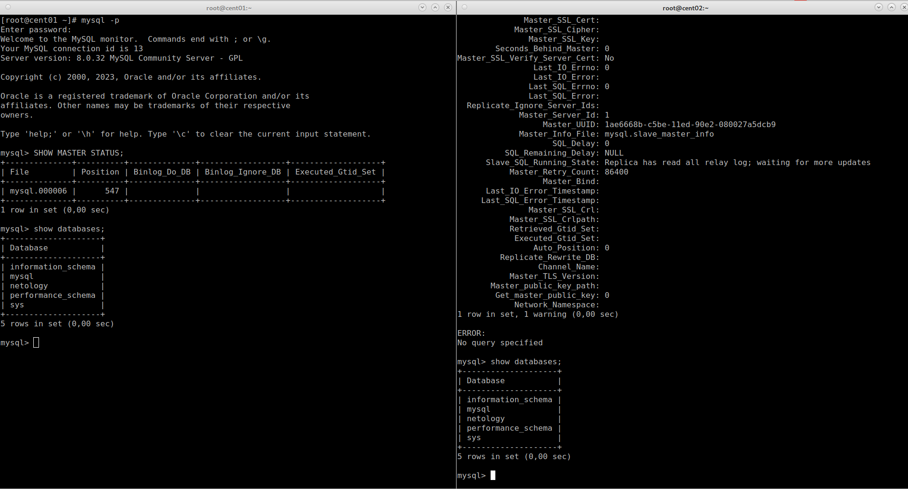

# Домашнее задание к занятию "`12.6. «Репликация и масштабирование. Часть 1»`" - `Живарев Игорь`


### Задание 1

`На лекции рассматривались режимы репликации master-slave, master-master, опишите их различия.`

 `Основных различий между репликациями master-master и mster-slave являются обменен данными между серверами и правами доступа к базам данных.`
 `То есть, в случае репликации master-master (или круговая репликация) обмен данными идет от первого master ко второму и от второго к первому. Так же обе БД имеют права на чтение, запись и модификацию данных.`
 `Во-втором случае, репликация master-slave данные передаются от mastera к slave, при этом база данных на slave может быть доступена но только в режиме чтения.`
 `Минус репликации master-master заключается в опасности разрыва связанности между серверами. При варианте когда связь между серверами отсутствует и при этом доступ пользоватили имеет как к первому master-у так и ко второму. Большая вероятность получить модификации баз данных на обоих сервера при которых востановить связанность не удастся. Или удастся, но с очень высокими трудо затратами.`
 `Минус репликации master-slave в небольшом различии между БД обоих серверов, существует большая вероятность отставания slave от изменений в БД на master-е. При этом вышеперечисленные трудности как у репликации master-master не возможны, поскольку изменения происходят только в БД master-а.`


### Задание 2

`Список выполненых команд при выполнении домашнего задания:`


```
rpm -ihv https://dev.mysql.com/get/mysql80-community-release-el7-7.noarch.rpm
rpm --import https://repo.mysql.com/RPM-GPG-KEY-mysql-2022
yum -y install mysql-server mysql-client
mkdir -p /var/log/mysql
mysqld --initialize
chown -R mysql: /var/lib/mysql
chown -R mysql: /var/log/mysql


nano /etc/my.cnf
Только на Master
bind-address = 0.0.0.0
server_id = 1
log_bin = /var/log/mysql/mysql.log

Только на Slave
bind-address = 0.0.0.0
server_id = 2
log_bin = /var/log/mysql/mysql.log

Сгенерированные пароли командой mysqld --initialize
cent01
root@localhost: a6gKai6SF&C?
cent02
root@localhost: xozsuu=a6suN

mysql
ALTER USER 'root'@'localhost' IDENTIFIED BY '0106';
FLUSH PRIVILEGES;

Только на Master
SHOW MASTER STATUS;

CREATE USER 'replication'@'%' IDENTIFIED WITH mysql_native_password BY '1234';
GRANT REPLICATION SLAVE ON *.* TO 'replication'@'%';

Только на Slave
CHANGE MASTER TO MASTER_HOST='192.168.20.103', MASTER_USER='replication', MASTER_PASSWORD='1234', MASTER_LOG_FILE='mysql.000006', MASTER_LOG_POS=350;
START SLAVE;
SHOW SLAVE STATUS\G;

```

`Листинг файла /etc/my.cnf обоих серверов`



`Результат работы репликации (мигрирование таблицы netology) и вывод комманды SHOW SLAVE STATUS\G; на Slave`




---
